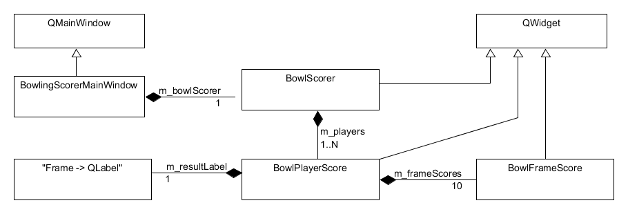

# WorlBowlingScorer
Scorer Appplication for Sportive Disipline "World-Bowling"
 
## PDF description ##
 [Complete English Description](./WorldBowlingScore-2020-10-08.pdf)

## UML Diagrams ##
  A UML diagram tells more than 1000 words.
 
### UML-Overview ###
 
 
### Detailed UML View ###
 

   
### Openissues ###

At the momnet, the project lacks an exhausted set of UnitTests.

A comaprison with a reference implementation has been shown some deviations.
which have been erased.
